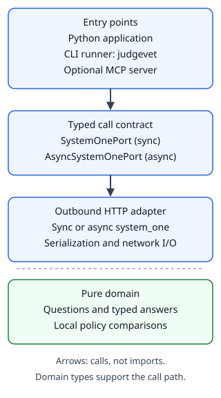
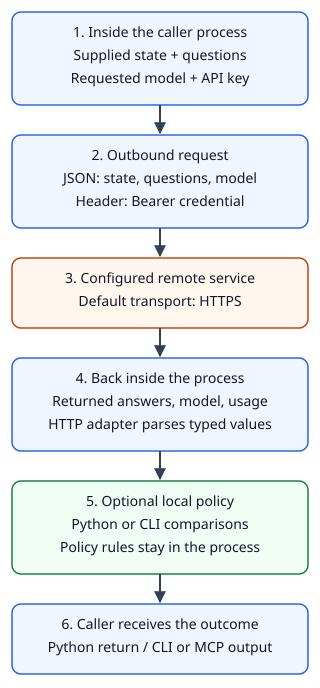

# Why the library is the artifact

Status: **draft**. This page describes the shipped package architecture.
It does not expand the [live-service evidence](verification.md).

A Python application, a shell script and an MCP host need different ways to
ask a judgment question. They still need the same question types, typed answers
and service-error behavior. judgevet puts that shared contract in an importable
library. The CLI and MCP server adapt their respective inputs to that contract.

This decision lets a Python application use the types directly, without
launching a subprocess or speaking MCP. It lets shell and agent callers use
the same outbound HTTP adapter. The choice is about the caller's environment,
not a different model behind each entry point.

## Choose the boundary that fits your caller

| Caller | Entry point | What the caller handles |
|---|---|---|
| Python application | Synchronous or asynchronous HTTP adapter | Explicit configuration, adapter lifetime, typed answers and application actions |
| Shell script or CI job | `judgevet` command | Input files or arguments, environment, stdout/stderr and exit status |
| MCP host | `judgevet-mcp` stdio process | Host configuration, process connection, tool discovery and protocol answers |

The [installation guide](../how-to/install.md) covers the commands.
The [Python policy guide](../how-to/use-policy-library.md#own-the-adapter-lifecycle)
shows synchronous and asynchronous ownership. A Python CI job can import the
library; a shell CI job can use the CLI. A CI system can also run an MCP client
when that protocol is part of its workflow. MCP is not inherently restricted
to interactive agents.

judgevet is unofficial. The [official TypeSafe Python SDK](https://docs.typesafe.ai/sdk/python)
also provides typed questions and synchronous and asynchronous clients.
Library-first architecture is judgevet's design choice, not a claim that other
integrations lack Python clients.

## Ports separate callers from HTTP

A **port** describes the operations and types a caller needs. `SystemOnePort`
and `AsyncSystemOnePort` define synchronous and asynchronous `system_one` calls
returning `SystemOneResponse`. A caller can accept a compatible port rather
than construct a concrete HTTP adapter inside its business logic. See the
[port protocols](../../src/judgevet/ports/__init__.py).

The outbound [HTTP adapter](../../src/judgevet/adapters/outbound/http.py) owns
network requests and serialization. It returns typed answers and translates
supported HTTP failures into the service-error hierarchy. The domain contains
question, answer and policy types and their local validation. It performs no
network or filesystem operations.

This boundary helps testing: a fake port can supply a known answer to a caller
without a credential or service. It also has a cost. A fake must honor the
same contract, including errors and return types. A test that only exercises
the fake cannot establish that a remote call works. The
[verification explanation](verification.md) describes what contract tests prove.

## Read the call path

*Call direction, not import direction.* The port box names a structural contract;
it is not an extra runtime proxy. Python callers can call the concrete adapter
directly. The CLI runner and MCP factory accept the sync port. Async library
callers use the async adapter and port.

Text equivalent: a Python application, CLI runner or MCP server supplies state
and questions to `system_one`. The concrete HTTP adapter sends the request and
returns typed answers. Shared domain types describe questions, answers and local
policies without performing I/O. The separate domain box is not a subsequent
network step. Composition roots construct and close their adapters, as described
below. Import-dependency rules are described under the installation boundary;
the arrows do not represent those rules.

## The entry point owns the adapter it creates

The core CLI runner and MCP server factory accept a port. Their command entry
points read settings, construct an HTTP adapter, pass it in and close it when
the command or server ends. This assembly is sometimes called a composition
root. See the [CLI entry point](../../src/judgevet/adapters/inbound/cli.py) and
[MCP entry point](../../src/judgevet/adapters/inbound/mcp_entrypoint.py).

Direct library use gives that responsibility to your application. Pass the
key explicitly; the adapter does not read credential environment variables
itself. Use `with` for the synchronous adapter or `async with` for the
asynchronous adapter. If you manage the lifetime manually, arrange `close()`
or `await aclose()` even when a call raises. Reuse within a chosen lifetime is
an application decision; there is no hidden global client owner.

Closing releases the HTTP client's resources. It does not erase all credential
copies from Python memory. Settings validation used by CLI/MCP also does not
run automatically for a direct library constructor. Review
[credential and transport responsibilities](../../SECURITY.md) when choosing a
base URL, transport or logging configuration.

The CLI and MCP setup configure stderr diagnostics. Importing the library does
not configure the application's logging. This makes embedding less intrusive,
but it leaves the application responsible for its handlers and disclosure risks.

## Local policy remains separate from transport

`judgevet.policy` evaluates typed answers with pure local comparisons.
`judgevet.policy_json` decodes the JSON policy format separately. A Python
caller can construct typed rules without treating JSON as the domain model.
The CLI uses the shared comparisons while retaining its published error and
malformed-answer behavior. See [compatibility](../reference/compatibility.md).

MCP currently exposes question tools, not a policy-evaluation tool. Sharing
core types does not mean every entry point exposes every library operation.
For policy use, choose the Python API or the CLI's policy option. A local
policy decision also does not trigger an external action; the caller owns that.

## Optional MCP keeps installation boundaries explicit

The base distribution installs the library and CLI without the MCP runtime.
The `mcp` extra adds that runtime for the server. This keeps Python and shell
callers from needing an agent protocol merely to obtain a typed answer.
The tradeoff is explicit installation and connection setup for MCP users.
See the [dependency declaration and import contracts](../../pyproject.toml).

Import contracts enforce the layer order and forbid I/O dependencies in the
domain. They also prevent domain, ports and outbound modules from depending
on MCP, and keep the policy facade and JSON decoding separate from adapters.
These are checks on package dependencies, not claims about model accuracy or
remote-service availability.

## Follow data across the process boundary

*One successful judgment path, followed by optional local policy evaluation.*
The diagram does not describe an automatic retry or a mandatory policy step.
The default service host and payload follow the
[vendor quick start](https://docs.typesafe.ai/introduction/quickstart).

Text equivalent:

1. The caller supplies state, named questions and the requested model. The
   adapter receives an explicit key from the application or composition root.
2. The HTTP adapter sends state, questions (including instructions and criteria)
   and model as JSON. It sends the key in a Bearer authorization header.
3. The configured remote service receives those values. The default URL uses
   HTTPS. A replacement URL receives the same payload and credential. Direct
   library callers own URL and transport selection; CLI/MCP settings reject
   remote plaintext HTTP but allow loopback HTTP for testing.
4. The service returns answers, resolved model and usage. The adapter parses
   typed values or raises an error. Errors leave this successful path; see the
   [error reference](../reference/errors.md).
5. Python callers or the CLI can evaluate a policy locally. Policy rules are
   not sent to the service. MCP exposes no policy tool and skips this step.
6. The library returns to its caller. CLI answers use stdout; MCP sends protocol
   content to its host over stdio. The caller or host decides subsequent actions.

CLI/MCP diagnostics use stderr. Library imports do not configure logging.
Diagnostic events are distinct from CLI error envelopes and MCP protocol error
content. Remote text and arbitrary tracebacks can disclose content; the diagram
does not imply universal redaction. See [diagnostic limits](../../SECURITY.md#diagnostics-and-error-content).
The host or application can persist output outside judgevet. Service retention
and deletion policy are not established by this client.

These edges follow the [HTTP adapter](../../src/judgevet/adapters/outbound/http.py),
[CLI](../../src/judgevet/adapters/inbound/cli.py),
[MCP adapter](../../src/judgevet/adapters/inbound/mcp.py) and
[local policy evaluator](../../src/judgevet/domain/policy_evaluation.py).
The [security policy](../../SECURITY.md#data-sent-to-the-service) records the full
transport and disclosure limits. Retries are opt-in and remain in the outbound adapter. No audit sink, pre-send
content redaction or storage control is part of this path.

## Alternatives and consequences

An MCP-only design would make protocol handling part of every caller's job.
A CLI-only design would make Python callers manage processes and parse output.
Independent clients for each entry point could evolve without a common
contract, but their parsing and error behavior would need separate maintenance.
The shared typed boundary avoids those requirements at the cost of maintaining
ports, adapters and compatibility across public surfaces.

That separation does not itself implement retries, spend caps, persistent
auditing or a gateway. Nor does it guarantee universal redaction. The
[security policy](../../SECURITY.md) states the shipped protections and limits.
Use the [documentation map](../index.md) to choose a task guide, and the
[supported-import reference](../reference/compatibility.md) to distinguish public
contracts from internal source modules.
