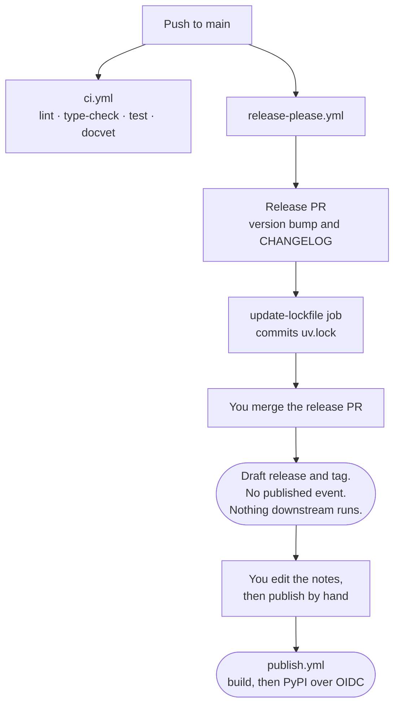

# Cut a release

release-please cuts every release from the commit history. You never edit a
version by hand. The release is created as a **draft**, so nothing reaches
PyPI until you publish it yourself. This page shows what runs, in what order,
and where you are expected to intervene.

## The flow

## What you do, and what you never do

| step | who |
|---|---|
| land conventional commits on `main` | you, normally |
| open the release PR, bump versions, write the CHANGELOG | release-please |
| refresh `uv.lock` on the release branch | the `update-lockfile` job |
| merge the release PR | **you** |
| cut the draft release and its tag | release-please |
| edit the draft notes and publish | **you** |
| build and upload to PyPI | `publish.yml`, over OIDC |

Never edit a version by hand. Four places carry it — `pyproject.toml`,
`__version__` in `src/judgevet/__init__.py`, `.release-please-manifest.json`
and `uv.lock` — and release-please moves all four together. Editing one makes
them disagree silently.

## Before you merge the release PR

The PR body carries the checklist. The item worth dwelling on is
`STATUS.md`'s verified-versus-inferred table: a release publishes claims, and
that table is where this project records which claims a call has actually
exercised. If a line moved from inferred to verified without a call that did
it, stop.

## Standing permission, and its limits

Alberto granted standing permission on 2026-09-21 to merge the release PR,
edit the draft and publish, without asking each time. The bar for using it:

**Cut a release when** CI is green on `main`; the wheel installs and works in
a clean virtualenv built from the published artifact, not the local build;
`STATUS.md`'s verified-versus-inferred table is accurate, with no line moved
to verified without a call that did it; nothing open would be hit by someone
running `pip install judgevet`; and the changelog entry reads as something a
stranger can use.

**Hold and ask instead when** a change breaks an API that is already
published — 0.1.0 is on the index, so that bar is real from here rather than
theoretical; when the verified-versus-inferred table changes in a way that
alters what a user should trust; or when a step needs a credential or a
decision only a human has.

Publishing is the one irreversible step in this repository. A version can be
yanked but never replaced, so the check that matters most is the clean-venv
install from the index, because it is the only one that tests what a user
actually receives.

## Publishing the draft

Publishing is the only irreversible step, and it is deliberately manual.
`publish.yml` triggers on `release: types: [published]` — not on a push, not
on a tag, not on a merge. Until someone clicks publish, nothing can reach the
index.

Edit the draft notes first. The generated CHANGELOG says what changed;
the release notes should say what the release is *for*.

## Testing the path without publishing

`test-publish.yml` is `workflow_dispatch` only and uploads to TestPyPI. The
`testpypi` index in `pyproject.toml` sets `explicit = true`, so dependency
resolution never reaches it — that is a supply-chain property, not a
convenience, and it should stay.

## When release-please fails

If the run fails with `Resource not accessible by personal access token`,
`RELEASE_PLEASE_TOKEN` is under-scoped. It needs three permissions, not two:

| token type | what to set |
|---|---|
| fine-grained | Contents read/write, Pull requests read/write, **Issues read/write**, scoped to this repository |
| classic | `repo` |

Issues is the one that gets missed: GitHub routes pull request *labels*
through the Issues API, and release-please labels its release PRs.

**Never test a token change by re-running the failed job.** A re-run reuses
that run's secret snapshot, so the old token is used again and the fix looks
like it did nothing. Push a commit instead — release-please runs on every push
to `main`, so the next one tests it for free.
